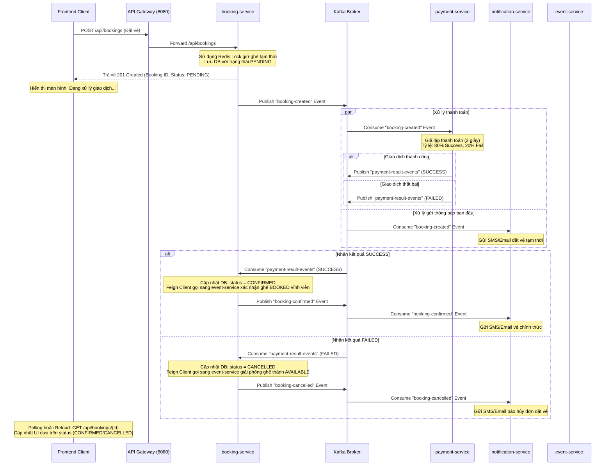

# NovaCine: Tài liệu Tổng quan Dự án & Trạng thái Hệ thống (Dành cho Frontend)

Tài liệu này cung cấp toàn bộ thông tin cần thiết về kiến trúc backend, luồng nghiệp vụ bất đồng bộ (Saga Pattern) và đặc tả API của dự án **NovaCine (Movie Theater Ticketing Platform)** để phục vụ cho việc phát triển giao diện người dùng (Frontend).

---

## 1. Tổng quan Kiến trúc Hệ thống

Hệ thống được thiết kế theo kiến trúc **Microservices** hướng sự kiện bất đồng bộ (Event-Driven Architecture) sử dụng **Spring Boot**, **Spring Cloud Gateway**, **Redis**, và **Apache Kafka**.

### Danh sách các Service & Cổng kết nối (Ports):

*   **API Gateway (`api-gateway`)** - **Port `8080`**: Cổng kết nối duy nhất của Frontend. Mọi request từ Frontend đều phải gửi qua gateway này.
*   **Discovery Server (`discovery-server`)** - **Port `8761`**: Eureka Server quản lý đăng ký và phát hiện dịch vụ.
*   **Event Service (`event-service`)** - **Port `8081`**: Quản lý thông tin Phim (Movies), Lịch chiếu (Showtimes), và Ghế ngồi (Seats). Tích hợp Redis Caching cho danh sách phim & lịch chiếu để tối ưu hiệu năng.
*   **Booking Service (`booking-service`)** - **Port `8082`**: Quản lý đặt vé (Bookings) và sơ đồ ghế được chọn trong đơn hàng. Tích hợp **Redis Distributed Lock (Redisson)** để đảm bảo chống race condition (trùng ghế) tuyệt đối khi nhiều người đặt cùng lúc.
*   **Payment Service (`payment-service`)** - **Port `8083`**: Mô phỏng xử lý thanh toán bất đồng bộ qua Kafka, lưu database lịch sử giao dịch.
*   **Notification Service (`notification-service`)** - **Port `8084`**: Lắng nghe sự kiện từ Kafka và mô phỏng gửi SMS/Email thông báo cho khách hàng bằng định dạng log trực quan.
*   **Common Module (`common`)**: Chứa các lớp dùng chung như định dạng phản hồi API (`ApiResponse`), cấu trúc lỗi (`ErrorCode`) và các Event gửi qua Kafka.

---

## 2. Luồng Nghiệp vụ Đặt Vé Bất đồng bộ (Saga Pattern)

Để đảm bảo hiệu năng cao và giảm tối đa thời gian phản hồi API tạo đơn hàng, hệ thống áp dụng luồng xử lý bất đồng bộ sử dụng Kafka làm Broker điều phối (Saga Pattern):



### Hướng dẫn dành cho Frontend:
1. Khi người dùng chọn ghế và nhấn nút "Đặt vé", Frontend gửi yêu cầu tới `POST /api/bookings`.
2. Phản hồi trả về **tức thời** (chỉ mất vài mili-giây) chứa thông tin đơn hàng với trạng thái `PENDING`.
3. Frontend hiển thị màn hình chờ thanh toán/xử lý và thực hiện **Cơ chế Polling** (gọi lại `GET /api/bookings/{id}` sau mỗi 1-2 giây) để cập nhật trạng thái đơn hàng.
4. Sau khoảng 2 giây, trạng thái sẽ chuyển thành `CONFIRMED` (đặt vé thành công) hoặc `CANCELLED` (thanh toán thất bại). Frontend hiển thị thông báo kết quả tương ứng cho người dùng.

---

## 3. Cấu trúc Response & Xử lý Lỗi chuẩn hóa

Tất cả các API của hệ thống đều sử dụng chung một định dạng phản hồi JSON chuẩn hóa:

### Định dạng thành công:
```json
{
  "code": "SUCCESS",
  "message": "Success",
  "data": { ... } // Dữ liệu trả về (Object hoặc Array)
}
```

### Định dạng lỗi:
Khi xảy ra lỗi (ví dụ: trùng ghế, không tìm thấy phim, sai dữ liệu), hệ thống sẽ trả về mã HTTP tương ứng (400, 404, 500,...) kèm JSON chi tiết:
```json
{
  "code": "TÊN_MÃ_LỖI",
  "message": "Mô tả chi tiết nguyên nhân lỗi bằng Tiếng Anh",
  "data": null
}
```

### Danh sách Mã Lỗi chính Frontend cần bắt:

| Service | Mã lỗi (`code`) | Mô tả | HTTP Status |
| :--- | :--- | :--- | :--- |
| **Chung** | `INTERNAL_SERVER_ERROR` | Lỗi máy chủ hệ thống | 500 Internal Server Error |
| **Chung** | `RESOURCE_NOT_FOUND` | Không tìm thấy tài nguyên | 404 Not Found |
| **Chung** | `INVALID_INPUT` | Dữ liệu đầu vào không hợp lệ (sai format, thiếu trường) | 400 Bad Request |
| **Event** | `MOVIE_NOT_FOUND` | Không tìm thấy phim tương ứng với ID cung cấp | 404 Not Found |
| **Event** | `SHOWTIME_NOT_FOUND`| Không tìm thấy lịch chiếu tương ứng với ID cung cấp | 404 Not Found |
| **Event** | `SEAT_NOT_FOUND` | Không tìm thấy ID ghế ngồi | 404 Not Found |
| **Event** | `SEATS_ALREADY_RESERVED`| Ghế đã được người khác đặt trước đó trong DB | 400 Bad Request |
| **Booking**| `SEAT_ALREADY_PROCESSED`| Ghế đang được giữ tạm thời bởi một giao dịch khác (Redis Lock) | 400 Bad Request |
| **Booking**| `BOOKING_NOT_FOUND` | Không tìm thấy đơn hàng đặt vé | 404 Not Found |

---

## 4. Chi tiết đặc tả API (gọi qua Gateway: `http://localhost:8080`)

### 4.1. Lấy danh sách phim đang chiếu
*   **Endpoint**: `/api/events/movies`
*   **Method**: `GET`
*   **Response**:
    ```json
    {
      "code": "SUCCESS",
      "message": "Get all movies successfully",
      "data": [
        {
          "id": "bd298426-ef40-441a-9b21-3d20bfffa316",
          "title": "Lat Mat 7: Mot Dieu Uoc",
          "genre": "Drama/Family",
          "duration": 138,
          "releaseDate": "2026-06-05"
        }
      ]
    }
    ```

### 4.2. Lấy danh sách lịch chiếu của phim theo ngày
*   **Endpoint**: `/api/events/showtimes`
*   **Method**: `GET`
*   **Params**:
    *   `movieId` (UUID): ID của phim.
    *   `showDate` (Date - format `YYYY-MM-DD`): Ngày chiếu.
*   **Response**:
    ```json
    {
      "code": "SUCCESS",
      "message": "Get showtimes successfully",
      "data": [
        {
          "id": "3043a97e-dab1-48ed-a3ee-08663959ed6d",
          "movieId": "bd298426-ef40-441a-9b21-3d20bfffa316",
          "showDate": "2026-06-05",
          "startTime": "19:00:00",
          "endTime": "21:18:00",
          "roomName": "Room 2",
          "ticketPrice": 90000.00
        }
      ]
    }
    ```

### 4.3. Lấy sơ đồ ghế và trạng thái ghế theo lịch chiếu
*   **Endpoint**: `/api/events/showtimes/{showtimeId}/seats`
*   **Method**: `GET`
*   **Response**:
    ```json
    {
      "code": "SUCCESS",
      "message": "Get seats successfully",
      "data": [
        {
          "id": "8a8cc363-aa4b-4b9a-b6f0-fd71f8c7a960",
          "showtimeId": "3043a97e-dab1-48ed-a3ee-08663959ed6d",
          "seatNumber": "A5",
          "status": "AVAILABLE" // Các trạng thái: AVAILABLE, RESERVED (đang được giữ hoặc đã thanh toán)
        },
        {
          "id": "f62c3e7b-1ed3-4363-8190-b9454705c835",
          "showtimeId": "3043a97e-dab1-48ed-a3ee-08663959ed6d",
          "seatNumber": "A6",
          "status": "RESERVED"
        }
      ]
    }
    ```

### 4.4. Gửi yêu cầu đặt vé (Tạo đơn hàng PENDING)
*   **Endpoint**: `/api/bookings`
*   **Method**: `POST`
*   **Request Body**:
    ```json
    {
      "userId": "customer_trouni",
      "showtimeId": "3043a97e-dab1-48ed-a3ee-08663959ed6d",
      "seatIds": [
        "8a8cc363-aa4b-4b9a-b6f0-fd71f8c7a960",
        "f62c3e7b-1ed3-4363-8190-b9454705c835"
      ],
      "seatNumbers": ["A5", "A6"],
      "bookingDate": "2026-06-05",
      "totalPrice": 180000.00
    }
    ```
*   **Response (201 Created)**:
    ```json
    {
      "code": "SUCCESS",
      "message": "Booking created successfully",
      "data": {
        "id": "89655780-0f14-4c46-9b92-2df4d80bed23",
        "userId": "customer_trouni",
        "showtimeId": "3043a97e-dab1-48ed-a3ee-08663959ed6d",
        "totalPrice": 180000.00,
        "status": "PENDING", // Trạng thái ban đầu luôn là PENDING
        "createdAt": "2026-06-05T10:40:48.341",
        "seats": [
          {
            "id": "27b2c589-d41a-471e-ba5e-5fb09a89d701",
            "bookingId": "89655780-0f14-4c46-9b92-2df4d80bed23",
            "seatId": "8a8cc363-aa4b-4b9a-b6f0-fd71f8c7a960",
            "seatNumber": "A5",
            "bookingDate": "2026-06-05"
          },
          {
            "id": "92186832-60cc-491c-8e34-58fffa89d702",
            "bookingId": "89655780-0f14-4c46-9b92-2df4d80bed23",
            "seatId": "f62c3e7b-1ed3-4363-8190-b9454705c835",
            "seatNumber": "A6",
            "bookingDate": "2026-06-05"
          }
        ]
      }
    }
    ```

### 4.5. Lấy chi tiết đơn hàng đặt vé (Dùng cho Polling)
*   **Endpoint**: `/api/bookings/{bookingId}`
*   **Method**: `GET`
*   **Response (Sau khi thanh toán thành công)**:
    ```json
    {
      "code": "SUCCESS",
      "message": "Get booking details successfully",
      "data": {
        "id": "89655780-0f14-4c46-9b92-2df4d80bed23",
        "userId": "customer_trouni",
        "showtimeId": "3043a97e-dab1-48ed-a3ee-08663959ed6d",
        "totalPrice": 180000.00,
        "status": "CONFIRMED", // Trạng thái đã chuyển sang CONFIRMED (hoặc CANCELLED)
        "createdAt": "2026-06-05T10:40:48.341",
        "seats": [
          {
            "id": "27b2c589-d41a-471e-ba5e-5fb09a89d701",
            "bookingId": "89655780-0f14-4c46-9b92-2df4d80bed23",
            "seatId": "8a8cc363-aa4b-4b9a-b6f0-fd71f8c7a960",
            "seatNumber": "A5",
            "bookingDate": "2026-06-05"
          },
          {
            "id": "92186832-60cc-491c-8e34-58fffa89d702",
            "bookingId": "89655780-0f14-4c46-9b92-2df4d80bed23",
            "seatId": "f62c3e7b-1ed3-4363-8190-b9454705c835",
            "seatNumber": "A6",
            "bookingDate": "2026-06-05"
          }
        ]
      }
    }
    ```

---

## 5. Hướng dẫn chạy thử Nghiệm thu bằng Postman

Bạn có thể import bộ sưu tập API trực tiếp tại file: [NovaCine_API_Collection.json](file:///d:/Own%20project/New%20folder/Movie-theater-ticketing-platform/NovaCine_API_Collection.json) vào Postman để thử nghiệm đầy đủ các endpoint trên qua Gateway (Port `8080`).

---

## 6. Hướng dẫn sử dụng và khởi tạo Codegraph Index cho Frontend

### 6.1. Codegraph có hữu ích cho code Frontend không?
**Cực kỳ hữu ích!** Khi phát triển Frontend (React, Vue, Next.js, v.v.), cơ sở dữ liệu Codegraph giúp AI Agent mới:
*   **Hiểu nhanh cấu trúc dự án**: Tự động nhận diện cấu trúc các components, định vị các file định tuyến (routing) và bố cục (layout).
*   **Quản lý State và Data Flow**: Tìm kiếm nhanh các API client services, React Hooks, Context, hoặc các global store (Redux, Zustand, Pinia) và theo dõi luồng dữ liệu giữa các component.
*   **Hạn chế trùng lặp code**: Giúp Agent phát hiện nhanh các reusable components, UI helpers hay utilities đã được viết sẵn trong dự án Frontend để tái sử dụng.
*   **Dò tìm và sửa lỗi nhanh**: Tìm kiếm nhanh các component đang sử dụng một prop, type hoặc state cụ thể khi cần refactor hoặc sửa lỗi.

### 6.2. Hướng dẫn tạo Codegraph riêng dành cho dự án Frontend

Codegraph được tự động xây dựng bởi chính hệ thống IDE/Agent (như Cursor, VS Code extension, Gemini Antigravity) ngay khi bắt đầu phiên làm việc trong một workspace. Bạn không cần chạy các câu lệnh thủ công phức tạp để tạo nó. Dưới đây là hướng dẫn cụ thể:

*   **Trường hợp 1: Code Frontend chung một Workspace với Backend (Khuyên dùng)**
    *   Bạn chỉ cần khởi tạo thư mục dự án Frontend (ví dụ: `frontend/` hoặc `novacine-ui/`) ngay tại thư mục gốc của dự án này.
    *   Hệ thống IDE/Agent sẽ tự động quét các file JavaScript/TypeScript/HTML/CSS mới và cập nhật trực tiếp cấu trúc của Frontend vào cơ sở dữ liệu `.codegraph/codegraph.db` dùng chung của workspace. AI Agent trong conversation tiếp theo sẽ có khả năng đọc hiểu song song cả code Frontend và các endpoint của Backend một cách đồng bộ.
    *   *Lưu ý*: Hãy đảm bảo file `.gitignore` ở thư mục gốc của dự án đã bỏ qua thư mục `.codegraph/` (nó đã được cấu hình mặc định để không commit file index local lên Git).

*   **Trường hợp 2: Phát triển Frontend trên một Workspace/Repository độc lập**
    *   Nếu bạn tạo một thư mục và repository Git hoàn toàn riêng biệt cho Frontend.
    *   Khi bạn mở thư mục Frontend đó lên bằng IDE hỗ trợ AI Agent, hệ thống sẽ tự động quét toàn bộ code Frontend và tự động sinh ra thư mục `.codegraph` cùng file database `codegraph.db` riêng biệt cho dự án đó ở lần khởi chạy đầu tiên.
    *   *Khuyến nghị*: Để tránh commit các file cơ sở dữ liệu index local (thường nặng và không cần thiết trên Git), hãy tạo file `.gitignore` trong thư mục Frontend và thêm cấu hình sau:
        ```text
        # CodeGraph index database
        .codegraph/
        ```
